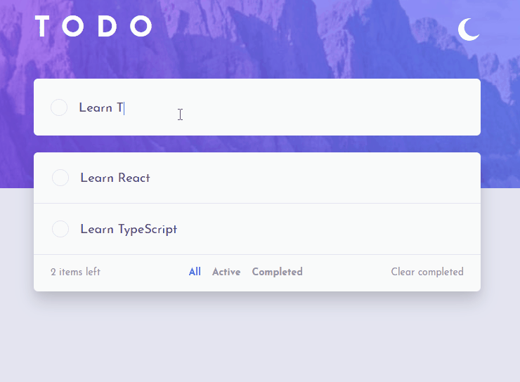

# Todo App

A solution to the [Todo app challenge](https://www.frontendmentor.io/challenges/todo-app-Su1_KokOW) on [Frontend Mentor](https://www.frontendmentor.io). Built with React, TypeScript, and Tailwind CSS.



## Features

- **Add tasks** — Type in the form and submit to add new tasks to the list
- **Filter tasks** — Switch between `All`, `Active`, and `Completed` views
- **Complete tasks** — Mark tasks as done with a single click
- **Delete tasks** — Remove a specific task with a delete button
- **Clear completed** — Remove all completed tasks at once
- **Light/Dark theme** — Toggle between themes, with distinct shadow styles for each

## Tech Stack

- [React](https://react.dev/) — UI library
- [TypeScript](https://www.typescriptlang.org/) — Static typing
- [Tailwind CSS](https://tailwindcss.com/) — Utility-first styling
- Custom hook `useTodo` — encapsulates all task logic (state management, filters, clear completed)

## Getting Started

```bash
# Clone the repository
git clone https://github.com/Wolfrand/todo-list-app.git

# Navigate to the project folder
cd todo-list-app

# Install dependencies
npm install

# Start development server
npm run dev
```

## What I Learned
 
- **Context API** — how to share state across components without prop drilling
- **Tailwind CSS** — utility-first styling and how to build layouts quickly with it
- **Mobile-first workflow** — designing for small screens first, then scaling up with responsive utilities
- **useState** — managing local component state effectively
- **Custom hooks** — how to extract and reuse logic with the `useTodo` hook
- **Functional state updates with `prev`** — using the previous state value to safely update state based on the current one

## How It Works

All task logic lives inside the `useTodo` custom hook, which exposes:

- The task list (filtered by the active filter)
- A function to add new tasks
- A function to toggle task completion
- A function to change the active filter (`all`, `active`, `completed`)
- A function to delete a specific task
- A function to clear all completed tasks